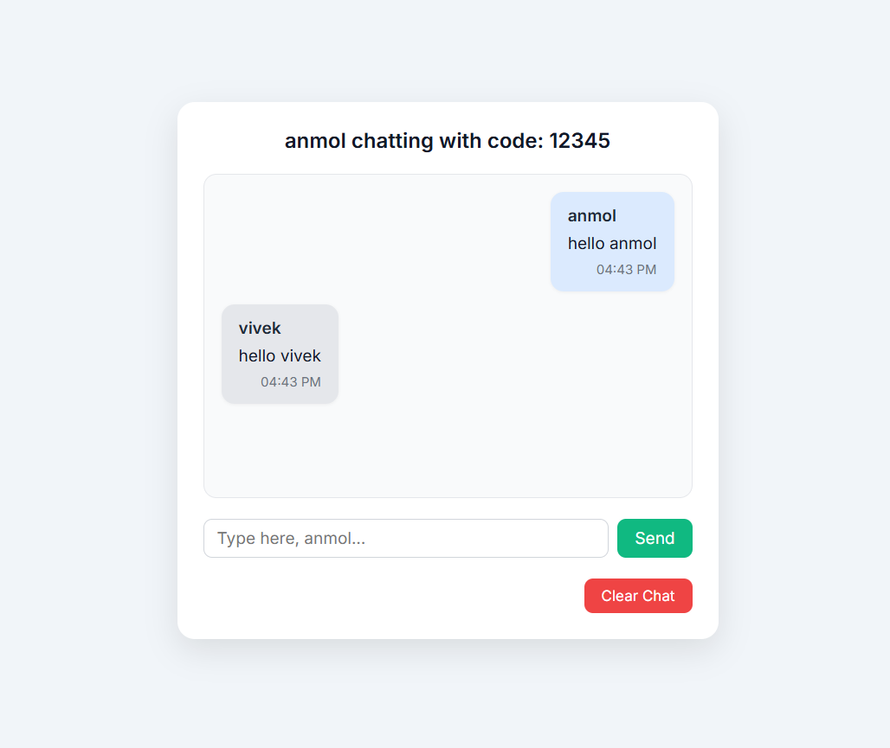

# 💬 ChatSpace

A real-time chat application built with **Node.js**, **Express**, and **WebSocket (ws)** that allows users to chat in private rooms by entering a username and shared chat code.

---

## 🌐 Live Demo
[chatspace is live here](https://chat-space-7c97.onrender.com)

---

## 🛠 Tech Stack

- **Frontend:** HTML, CSS, JavaScript (Vanilla)
- **Backend:** Node.js, Express
- **WebSockets:** `ws` package for real-time messaging

---

## ✨ Features

- 🔐 Join any room with a **custom chat code**
- 💬 Real-time messaging between clients in the same room
- 🧾 Chat bubbles styled dynamically by sender
- 🔄 Auto-scroll and clear chat
- 📱 Mobile responsive UI

---

## 🧪 How to Run Locally

```bash
# 1. Clone the repository
git clone https://github.com/anmolmishra08/chatspace.git
cd chatspace

# 2. Install dependencies
npm install

# 3. Start the server
node server.js

# 4. Open in your browser
http://localhost:3000
```

Open in two tabs or devices with the same chat code to test real-time messaging 🔁

---

## 📸 Screenshot

> (Add a screenshot here once you're ready!)


---


---

## 🙌 Author

Made with 💻 by **[Anmol Mishra](https://github.com/anmolmishra08)**  
2025

---

